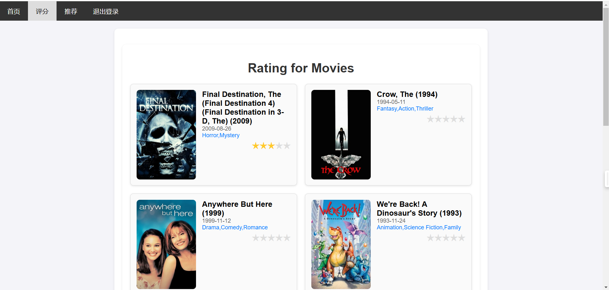

## 项目简介

本项目是一个基于 Flask 开发的电影评分与推荐系统，用户可以对电影进行评分，系统根据用户评分历史生成个性化的电影推荐列表。项目结合了机器学习推荐算法和高效的缓存与数据处理技术，旨在提供快速、精准的电影推荐服务。

项目地址：https://gitee.com/caudalfin24/recommendation

## 功能特性
- 用户管理
    - 用户注册、登录、登出功能。
    - 查看个人评分记录。
    - 电影评分
- 支持用户对电影进行评分（1~5星）。
    - 自动保存评分数据以供推荐算法使用。
- 个性化推荐
    - 基于用户评分的深度学习推荐模型，采用 NeuralCF 模型作为召回层模型，Wide & Deep 模型作为排序层模型。

## 技术栈
- 数据处理：Spark
- 后端框架：Flask
- 推荐算法：TensorFlow
- 数据库与缓存技术：Redis（支持 Pipeline）
- 前端框架：HTML、CSS


## 环境要求

启动服务前确保安装 Python3 以及 Redis 服务，并**保证 Redis 服务开启**。

本项目在 Windows 和 Ubuntu 操作系统下均测试证实良好运行。推荐在 Ubuntu 系统上运行。

- 测试环境1：
    - Ubuntu 18.04 LTS
    - Python 3.8.10
    - Redis 5.0.7
- 测试环境2：
    - Windows 11
    - Python  3.11.2
    - Redis 5.0.14.1


需求的 Python 模块：
- argon2-cffi
- flask
- pyspark
- redis
- requests
- tensorflow

**注意**：
 `tensorflow` 版本不建议超过 `2.16.0`，否则 `feature_column` 可能无法正常使用，推荐使用 `requirements.txt` 中的模块版本

快速安装模块（建议使用 anaconda 先创建环境）：
```bash
pip install -r requirements.txt
```

## 快速开始

### 安装 Redis 并启动 Redis 服务(以Ubuntu为例)：

```bash
sudo apt update
sudo apt install redis-server
```

检查 Redis 的工作状态：
```bash
sudo systemctl status redis-server
```

你应看到如下内容：
```bash
redis-server.service - Advanced key-value store
    Loaded: loaded (/lib/systemd/system/redis-server.service; enabled; vendor preset: enabled)
    Active: active (running) since Thu 2024-12-19 20:25:43 CST; 23min ago
```

### 项目的下载与启动

克隆仓库：
```bash
git clone https://gitee.com/caudalfin24/recommendation
cd recommendation
```

快速安装需要的模块（建议使用 anaconda 先创建环境）：
```bash
pip install -r requirements.txt
```

输入以下命令启动服务：
```bash
python3 app.py 
```

加载可能需要一段时间，出现如下信息表示服务运行成功。此时服务器运行于 5000 端口。
```bash
* Debugger is active!
* Debugger PIN: 958-335-656
``` 

浏览器输入 `localhost:5000` 以访问电影推荐系统。

## 功能介绍

进入系统自动跳转到**登陆**页面（对应路由 `/login`）


若没有注册账号，可以进行**注册**（对应路由 `/register`）


**首页**（路由`/index`）可以查看当前用户的档案信息与评分过的电影。


**评分**（路由`/rating`）页面随机展示10部电影。用户可以提交打分。



**推荐**（路由`/rec`）页面给出基于深度模型的推荐结果。


实现**退出登录**（路由 `/logout`）功能。

## 常见问题

```bash
raise ConnectionError(self._error_message(e))
redis.exceptions.ConnectionError: Error 10061 connecting to localhost:6379.
```

遇到如上问题，请安装 Redis 服务并保证 Redis 服务开启。

---

```
raise response
redis.exceptions.ResponseError: wrong number of arguments for 'hset' command
```

遇到如上问题，可以参考 ChatGPT 的回答，更改 Redis 版本。

> 问题可能出现在 Redis 版本差异：
> - Redis 6.2 及更高版本：hset 支持新的 > mapping 参数，允许传入一个字典。
> - Redis 6.0 及更低版本：hset 只接受 key-value > 对的平铺参数，不支持 mapping 参数。
> 你当前 Redis 服务器可能版本存在版本差异，导致代码中的参数不被接受。

## 开发者与分工

- 黄玮琦
    - 项目整体框架设计与路线选择，数据处理与离线模型训练
    - 完成贡献度 40%
- 蔡慈芫
    - 线上服务功能设计
    - 完成贡献度 30%
- 许秦玮
    - 前端界面设计与交互
    - 完成贡献度 30%